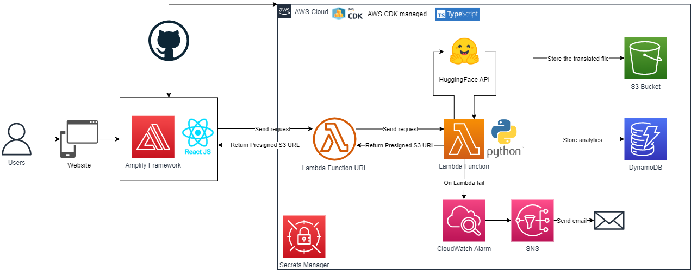

# subtitle-translator 🌎

## Visit the website 👉https://polysub.anebz.eu/

The Polysub app translates your subtitles. Just upload the file, select the source and target languages and get your translated subtitles powered by the powerful 🤗 Huggingface Inference API!

---

### AWS Architecture diagram

